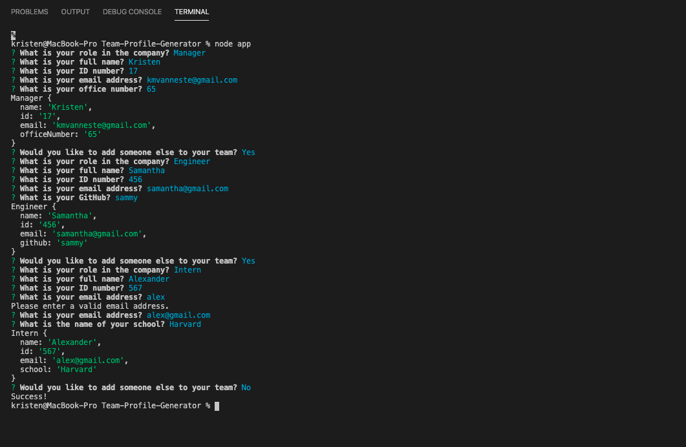

# Team-Profile-Generator

## Description
The Team-Profile-Generator is a quick and simple way to organize the contact information for your next team project.

## Installations
In order to get the Team-Profile-Generator to function on your device, you will need to fork this repository, install node.js, and initialize npm.

## Usage
This application is a great way to visualize the number of people and their role on your team.  Under every icon is their contact information as well as important personal information such as GitHub webpage, their id number, and their office number.

## Appearance
Here is an image of the terminal prompts:

Here is an image of the published application:

